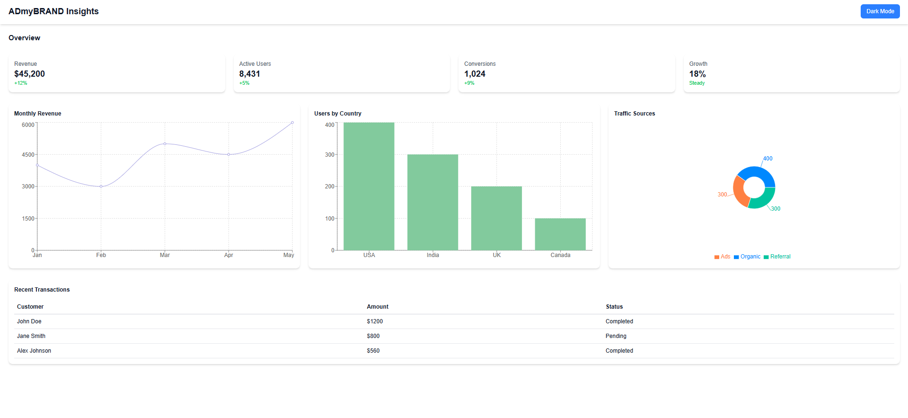

# AI-Powered Analytics Dashboard

An AI-powered analytics dashboard built with **Next.js**, **React**, and **Recharts**, featuring interactive data visualizations, dark mode, and a responsive UI.

[**Click here for Live Demo (Vercel)**](https://my-project-8gk9.vercel.app)

---

## Dashboard Preview

---

## Features
- Interactive charts (Line, Bar, and Pie) using **Recharts**
- Dark/Light mode toggle
- Responsive and clean layout
- Built with **Next.js 15** for fast performance
- Fully deployable and easy to customize

---

## Portfolio Note
This project is **portfolio-ready** and designed to showcase:
- React & Next.js development skills  
- Data visualization with Recharts  
- Clean, scalable, and deployable frontend design  

You can include this in your portfolio and share the **GitHub repo** and **Live Demo** as proof of work.

---

## AI Usage Report
This project was built with assistance from **ChatGPT (GPT‑4)** for:
1. Generating the initial React + Next.js dashboard structure  
2. Creating reusable **Card** and **ChartContainer** components  
3. Debugging **TypeScript and Vercel deployment issues**  
4. Drafting this **README with badges, screenshots, and portfolio sections**  

### Key Prompts Used:
- *“Build a Next.js dashboard with dark mode, Recharts (Line, Bar, Pie), and responsive cards.”*  
- *“Fix TypeScript type issue in page.tsx for Vercel deployment.”*  
- *“Write a professional README with badges, screenshot, and portfolio note.”*  

All code was **reviewed, tested, and customized manually** before deployment.

---

## Links
- **GitHub Repository:** [https://github.com/narayana-reddy-18/my-project](https://github.com/narayana-reddy-18/my-project)  
- **Live Demo (Vercel):** [https://my-project-8gk9.vercel.app](https://my-project-8gk9.vercel.app)
